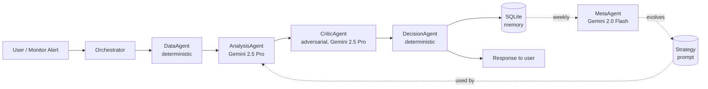
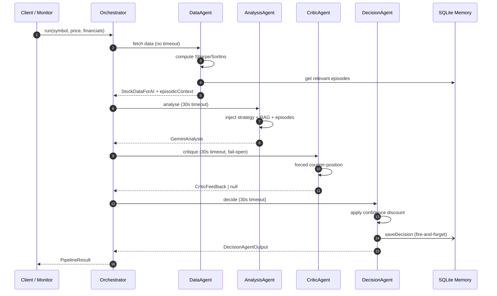

# Equra AI — Multi-Agent System

Equra AI is a production backend that generates, critiques, and learns from stock-analysis recommendations for the Egyptian Exchange (EGX). The core of the system is a five-agent pipeline coordinated by a lightweight orchestrator, backed by a long-term memory store and an autonomous learning loop.

This document walks through the agent architecture, tools used, token/cost strategy, integrations, and the end-to-end workflow — with direct links to the source code for every claim.

---

## Pipeline at a Glance

All agents implement a shared contract: [`Agent<TInput, TOutput>`](../server/agents/types.ts#L8-L10). The orchestrator sequences **Data → Analysis → Critic → Decision** with per-agent timeouts and fail-open degradation.

---

## Agent Structure & Roles

| Agent | Responsibility | LLM | Source |
|---|---|---|---|
| **DataAgent** | Deterministic data collection, risk ratio math, sentiment fetch, episodic memory lookup | None | [`data-agent.ts`](../server/agents/data-agent.ts#L43-L151) |
| **AnalysisAgent** | First-pass recommendation with RAG context and episodic memory injection | Gemini 2.5 Pro | [`analysis-agent.ts`](../server/agents/analysis-agent.ts#L4-L31) |
| **CriticAgent** | Adversarial review — forced to argue the opposite position | Gemini 2.5 Pro | [`critic-agent.ts`](../server/agents/critic-agent.ts#L69-L141) |
| **DecisionAgent** | Synthesises analysis + critique, applies confidence discount, sole writer to memory | None | [`decision-agent.ts`](../server/agents/decision-agent.ts#L8-L57) |
| **MetaAgent** | Weekly strategy evolution from scored outcomes | Gemini 2.0 Flash | [`meta-agent.ts`](../server/agents/meta-agent.ts#L6-L126) |

### DataAgent
Fetches price, volume, fundamentals, 252-day historical prices, and market sentiment. Computes Sharpe ([`data-agent.ts#L17-L26`](../server/agents/data-agent.ts#L17-L26)) and Sortino ([`data-agent.ts#L28-L39`](../server/agents/data-agent.ts#L28-L39)) ratios locally, then retrieves up to three relevant episodic lessons from memory ([`data-agent.ts#L117-L131`](../server/agents/data-agent.ts#L117-L131)). Returns a typed `StockDataForAI` object — all downstream agents consume the same canonical shape.

### AnalysisAgent
Thin wrapper over `analyzeStockWithGemini` that injects the current strategy prompt, RAG-retrieved excerpts from company financial reports, and episodic context. Returns a structured `GeminiAnalysis` with recommendation, confidence, fair value estimate, and zoned buy/sell thresholds. Implementation: [`analysis-agent.ts`](../server/agents/analysis-agent.ts).

### CriticAgent
Implements a **forced counter-position** prompting pattern: given a draft recommendation, the agent is required to argue the opposite side before any validation. The mapping lives in [`critic-agent.ts#L11-L22`](../server/agents/critic-agent.ts#L11-L22); the full prompt is built at [`critic-agent.ts#L24-L67`](../server/agents/critic-agent.ts#L24-L67). Output is Zod-validated and fails open — a timeout or invalid response returns `null` and the pipeline proceeds without critique ([`critic-agent.ts#L132-L140`](../server/agents/critic-agent.ts#L132-L140)).

### DecisionAgent
Deterministic synthesis. Applies a confidence discount based on critic severity ([`decision-agent.ts#L14-L17`](../server/agents/decision-agent.ts#L14-L17)) and is the **single writer** to the SQLite memory store — all other agents are read-only. Writes go through `setImmediate` so they don't block the HTTP response ([`decision-agent.ts#L32-L46`](../server/agents/decision-agent.ts#L32-L46)).

### MetaAgent
Runs weekly. Pulls scored decisions, filters out non-learnable outcomes (e.g. `THESIS_ERROR` only, to avoid learning from macro shocks), samples 30 recent + 10 random historical decisions, and asks Gemini Flash to evolve the active strategy prompt. New strategy versions are saved incrementally ([`meta-agent.ts#L58-L108`](../server/agents/meta-agent.ts#L58-L108)).

---

## Orchestrator

The orchestrator is intentionally small: it sequences agents, enforces per-agent timeouts, and degrades gracefully on failure. Source: [`orchestrator.ts`](../server/agents/orchestrator.ts).

- **Contract**: every agent returns either its typed output or `null` on timeout/error ([`withTimeout` helper, L12-L27](../server/agents/orchestrator.ts#L12-L27)).
- **Timeout budget**: 30 s per agent ([L9](../server/agents/orchestrator.ts#L9)). DataAgent has no timeout because it performs no LLM calls.
- **Fail-open**: if `AnalysisAgent` returns `null`, the pipeline emits a `Hold` fallback ([L46-L58](../server/agents/orchestrator.ts#L46-L58)). If `CriticAgent` times out, `DecisionAgent` still runs and ships the recommendation without critique ([L66-L78](../server/agents/orchestrator.ts#L66-L78)).
- **Feature flag**: the orchestrator is gated behind `USE_ORCHESTRATOR=true` ([`routes.ts#L938`](../server/routes.ts#L938)), so the legacy path stays untouched until flipped.

---

## Tools & Integrations

### LLMs
| Model | Role | Where |
|---|---|---|
| Gemini 2.5 Pro | Primary analysis + critique | [`gemini-service.ts#L21`](../server/gemini-service.ts#L21), [`critic-agent.ts#L6`](../server/agents/critic-agent.ts#L6) |
| Gemini 2.5 Flash | Quota fallback for Pro | [`gemini-service.ts#L22`](../server/gemini-service.ts#L22) |
| Gemini 2.5 Flash-Lite | Vision extraction (brokerage invoices) | `server/vision-service.ts` |
| Gemini 2.0 Flash | Weekly MetaAgent | [`meta-agent.ts#L7`](../server/agents/meta-agent.ts#L7) |
| Gemini Embedding (`gemini-embedding-001`) | RAG embeddings | [`ingest-pdfs.ts`](../server/scripts/ingest-pdfs.ts) |
| HuggingFace FinBERT | Headline sentiment scoring | `server/routes.ts` (`fetchSentimentForSymbol`) |

Alternative providers are wired up for budget/failover use but are not in the default hot path: Groq (Llama 4 Scout), Cerebras (gpt-oss-120b), HuggingFace Qwen 2.5-72B. See `server/ai-providers.ts`.

### Data sources
- **EODHD** — primary prices, fundamentals, news
- **TradingView scanner** — fallback prices, live fundamentals
- **CNBC quote service** — secondary price fallback
- **Mubasher** — fundamentals fallback
- **EGX static dataset** — last-resort P/E and dividend data for 85+ tickers

### Storage
- **SQLite via Drizzle ORM** — `decisions`, `episodes`, `strategy_prompts`, `thndr_transactions`, `calendar_events`, `push_tokens`. Schema: [`server/memory/memory-service.ts`](../server/memory/memory-service.ts).
- **LanceDB** — one vector table per ticker (`financial_reports_<symbol>`), populated from annual report PDFs.

### Data pipeline (scraping / cleansing / structuring)
- `pdf-parse` for native PDF text extraction, with Tesseract.js OCR fallback (Arabic + English) for scanned filings — triggered when fewer than three chunks are extracted. Chunks are embedded via Gemini and stored in LanceDB. Source: [`ingest-pdfs.ts`](../server/scripts/ingest-pdfs.ts).
- **Hybrid RAG retrieval**: query expansion → multi-variant vector search → Reciprocal Rank Fusion → keyword re-ranking. Source: [`rag-service.ts`](../server/rag-service.ts).
- **Brokerage invoice ingestion**: regex parsing for native PDFs, Gemini Vision for screenshots. Source: `server/thndr/`.

---

## Token Usage & Cost Management

The budget strategy lives in [`gemini-service.ts#L21-L61`](../server/gemini-service.ts#L21-L61).

1. **Dual-model fallback** — Pro is attempted first. After two `429` quota errors, the loop switches to Flash for the remainder of the run ([L34](../server/gemini-service.ts#L34)).
2. **Exponential backoff on transient failures** — `2^(attempt+1)` seconds for retryable errors, compressed to 1 s once the fallback model is in play ([L52](../server/gemini-service.ts#L52)).
3. **Output cap** — `maxOutputTokens: 8192` for analysis, tuned down for shorter endpoints ([L28](../server/gemini-service.ts#L28)).
4. **Temperature tuning** — 0.7 for reasoning tasks, 0.5 for deterministic comparisons.
5. **24-hour response cache** — analyses are keyed on symbol + input hash and served from cache when unchanged, eliminating redundant model calls ([`api-cache.ts`](../server/api-cache.ts)).
6. **Stale-cache fallback** — on upstream failure the most recent successful response is returned rather than erroring out.
7. **RAG confines prompt size** — only top-k re-ranked chunks are injected, so prompt length stays bounded regardless of report size.

The critic runs on a tighter 10 s timeout ([`critic-agent.ts#L8`](../server/agents/critic-agent.ts#L8)) precisely because its output is optional — paying for a long Pro call that the pipeline will discard on timeout is waste.

---

## End-to-End Workflow

### Trigger sources
1. **HTTP request** — `GET /api/analysis/:symbol` routes through the orchestrator when the feature flag is on ([`routes.ts#L938-L940`](../server/routes.ts#L938-L940)).
2. **Autonomous re-analysis** — monitoring alerts (price moves > 5 % on adequate volume, CBE rate changes) trigger the same orchestrator ([`index.ts#L267-L283`](../server/index.ts#L267-L283)).
3. **Scheduled jobs** — cron jobs score decision outcomes and run the MetaAgent ([`scoring-jobs.ts`](../server/jobs/scoring-jobs.ts)).

### Request flow

### Step-by-step

1. **Entry** — request enters `runOrchestratedPipeline` ([`routes.ts#L841`](../server/routes.ts#L841)), which builds the `DataAgentInput` and calls `orchestrator.run`.
2. **DataAgent** ([`orchestrator.ts#L34`](../server/agents/orchestrator.ts#L34)) fetches historical prices, computes risk ratios, pulls sentiment, and loads episodic memory. All network calls are non-fatal.
3. **AnalysisAgent** ([`orchestrator.ts#L37-L44`](../server/agents/orchestrator.ts#L37-L44)) builds the Gemini prompt, enforces a 30 s timeout, and returns a `GeminiAnalysis` or `null`.
4. **CriticAgent** ([`orchestrator.ts#L61-L64`](../server/agents/orchestrator.ts#L61-L64)) receives the analysis, argues the opposite position, and emits severity + blocking issues. Timeout or schema failure returns `null`.
5. **DecisionAgent** ([`orchestrator.ts#L67-L78`](../server/agents/orchestrator.ts#L67-L78)) discounts confidence by critic severity, produces the final recommendation, and writes the decision to SQLite via `setImmediate`.
6. **Response** — the orchestrator returns a `PipelineResult`; the HTTP layer adapts it to the public API shape that the legacy path also emits.

### Learning loop

Scheduled jobs in [`scoring-jobs.ts#L72-L103`](../server/jobs/scoring-jobs.ts#L72-L103) score outcomes against EODHD prices at 5-day, 30-day, and 90-day windows. Every Sunday 17:00 Cairo, the [MetaAgent](../server/agents/meta-agent.ts) reviews those scored decisions and rewrites the active strategy prompt. The next analysis request picks up the new prompt automatically via `memoryService.getLatestStrategyPrompt`.

### Autonomous monitoring

The [`price monitor`](../server/monitoring/price-monitor.ts#L57-L91) polls EODHD every 15 minutes during EGX market hours, filters out thin-volume moves, and emits alerts on the `monitoringBus`. The alert handler ([`index.ts#L267-L283`](../server/index.ts#L267-L283)) re-runs the orchestrator on the affected symbol. A separate CBE monitor ([`cbe-monitor.ts`](../server/monitoring/cbe-monitor.ts)) watches for rate-decision keywords in news and triggers re-analysis for rate-sensitive bank stocks.

---

## Key Architectural Patterns

- **Single-writer memory** — only `DecisionAgent` writes to SQLite, eliminating race conditions in concurrent requests.
- **Fail-open degradation** — every LLM call can return `null`; the pipeline always produces a response.
- **Fire-and-forget persistence** — memory writes run in `setImmediate` so they don't add to user-facing latency.
- **Forced counter-position prompting** — the critic is structurally prevented from agreeing with the analyst.
- **Episodic injection** — past lessons travel with the analysis prompt so the model can avoid repeating specific prior mistakes.
- **Confidence discount by severity** — high-severity critiques reduce confidence one tier, compounding the critic's signal into the final output.

---

## Beyond the Recommendation Pipeline

The five-agent orchestrator covers recommendation generation. The product has two further AI surfaces that sit outside that pipeline but share the same LLM and data infrastructure.

### Behavior Coaching
A separate analysis mode that ingests the user's own trading history (holdings, transactions, dividends, realized gains from the mobile app) and produces personal coaching — identified patterns, improvement areas, plain-English feedback, and a single "one thing to change" recommendation.

- Endpoint: `POST /api/ai/:provider/behavior-analysis` — [`routes.ts#L2293-L2318`](../server/routes.ts#L2293-L2318)
- Output schema (Zod-validated): `patterns[]`, `improvementAreas[]`, `feedback`, `oneThingToChange`, `reasoningSteps[]` — [`analysis-schemas.ts#L174-L184`](../server/schemas/analysis-schemas.ts#L174-L184)
- Invoked as `runAnalysis(provider, "behavior", { data })`, so it transparently supports the same multi-provider fallback (Gemini / Groq / Cerebras) as stock analysis.

### Transaction Import Pipeline (feeds Behavior Coaching)
Users can upload Thndr brokerage invoices as PDFs or screenshots; the backend extracts the transactions and normalises them into the SQLite memory store for later coaching and portfolio-aware analysis.

- PDF path — regex parsing of the standardised Thndr invoice layout: [`thndr/pdf-parser.ts`](../server/thndr/pdf-parser.ts)
- Screenshot path — Gemini Vision extraction: [`thndr/vision-extractor.ts`](../server/thndr/vision-extractor.ts)
- Symbol resolution (ISIN → ticker → fuzzy match → AI fallback): [`thndr/symbol-resolver.ts`](../server/thndr/symbol-resolver.ts)
- Orchestration + persistence to `thndr_transactions`: [`thndr/thndr-service.ts`](../server/thndr/thndr-service.ts), [`thndr/inbound-handler.ts`](../server/thndr/inbound-handler.ts)

---

## Source Map

| Concern | File |
|---|---|
| Agent contract | [`server/agents/types.ts`](../server/agents/types.ts) |
| Orchestration | [`server/agents/orchestrator.ts`](../server/agents/orchestrator.ts) |
| Data pipeline | [`server/agents/data-agent.ts`](../server/agents/data-agent.ts) |
| Primary LLM + fallback | [`server/gemini-service.ts`](../server/gemini-service.ts) |
| Critic prompt + Zod validation | [`server/agents/critic-agent.ts`](../server/agents/critic-agent.ts) |
| Memory + decisions + episodes | [`server/memory/memory-service.ts`](../server/memory/memory-service.ts) |
| Strategy evolution | [`server/agents/meta-agent.ts`](../server/agents/meta-agent.ts) |
| Scheduled learning jobs | [`server/jobs/scoring-jobs.ts`](../server/jobs/scoring-jobs.ts) |
| Price alerts (autonomous trigger) | [`server/monitoring/price-monitor.ts`](../server/monitoring/price-monitor.ts) |
| CBE rate alerts | [`server/monitoring/cbe-monitor.ts`](../server/monitoring/cbe-monitor.ts) |
| PDF ingestion (RAG) | [`server/scripts/ingest-pdfs.ts`](../server/scripts/ingest-pdfs.ts) |
| Hybrid RAG retrieval | [`server/rag-service.ts`](../server/rag-service.ts) |
| HTTP integration point | [`server/routes.ts`](../server/routes.ts) (search `runOrchestratedPipeline`) |
| Behavior Coaching endpoint | [`server/routes.ts`](../server/routes.ts#L2293-L2318) |
| Behavior Coaching schema | [`server/schemas/analysis-schemas.ts`](../server/schemas/analysis-schemas.ts#L174-L184) |
| Transaction import (Thndr) | [`server/thndr/`](../server/thndr/) |
